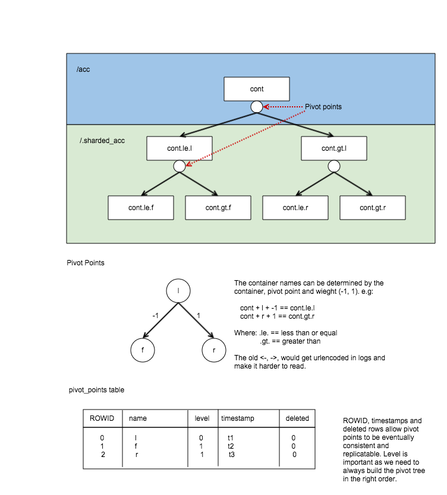
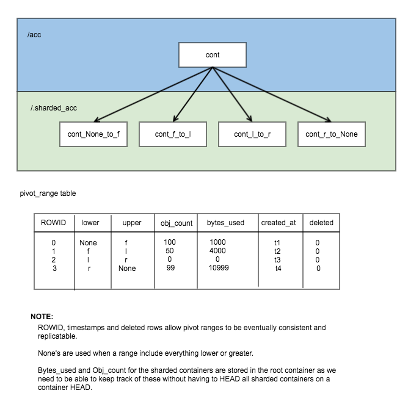
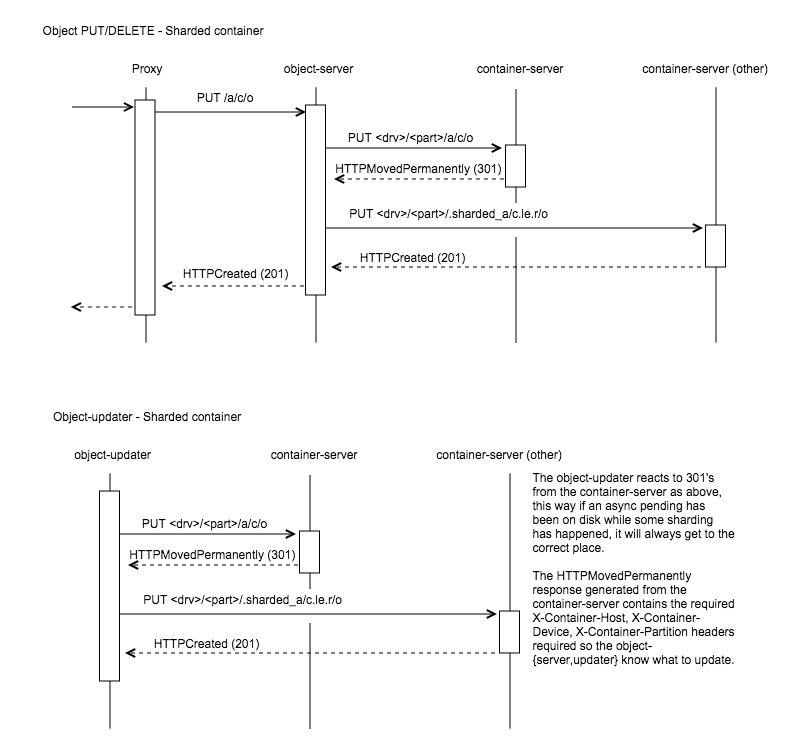

::

  This work is licensed under a Creative Commons Attribution 3.0
  Unported License.
  http://creativecommons.org/licenses/by/3.0/legalcode

..
  This template should be in ReSTructured text. Please do not delete
  any of the sections in this template.  If you have nothing to say
  for a whole section, just write: "None". For help with syntax, see
  http://sphinx-doc.org/rest.html To test out your formatting, see
  http://www.tele3.cz/jbar/rest/rest.html

===============================
Container Sharding
===============================

Include the URL of your blueprint:

https://blueprints.launchpad.net/swift/+spec/container-sharding

A current limitation in swift is the container database. The SQLite database
stores the name of all the objects inside the container. As the amount of
objects in a container grows, so does the size of the database file. This causes
higher latency due to the size and reading on the single file, and can be improved
by using container sharding.

Over the last year, there has been a few POC's covered, the last POC was using
distributed prefix trees, which although worked well (kept order and adding infinite sharding)
while at the last hackathon (August in Austin), it was found that it required too many requests. In
smaller or not high load clusters this would have been fine, but talking to users running clusters
in high load, this approach only added to their problems. The code for this approach can be found in
the sharding_trie branch of https://github.com/matthewoliver/swift/.

After discussions at the hackathon, it was decided we should try a similar but simpler approach. Which
I am calling the Pivot Range approach. This POC is being worked on in the sharding_range branch.

https://github.com/matthewoliver/swift/tree/sharding_range

Problem Description
===================

The SQLite database used to represent a container stores the name of all the objects
contained within. As the amount of objects in a container grows, so does the size of
the database file. Because of this behaviour, the current suggestion for clusters storing
many objects in a single container is to make sure the container databases are stored on
SSDs, to reduce latency when accessing large database files.

In a previous version of this spec, I investigated different approaches we could use
to shard containers. These were:

#. Path hashing (part power)

#. Consistent Hash ring

#. Distributed prefix trees (trie)

#. Pivot/Split tree (Pivot Ranges)

In discussions about the SPEC at the SFO Swift Hackathon, distributed prefix trees (trie)
became the forerunner. More recently at the Austin hackathon the prefix trie approach though
worked would cause more requests and on larger highly loaded clusters, may actually cause more
issues then it was solving.
It was decided to try a similar but simplified approach, which I'm calling the pivot (or split)
tree approach. This is what this version of the spec will be covering.

When talking about splitting up the objects in a container, we are only talking about the container metadata, not the objects themselves.

The Basic Idea
=================

The basic and simplified idea is rather simple. Firstly, to enable container sharding pass in a
"X-Container-Sharding: On" X-Header via either PUT or POST::

  curl -i -H 'X-Auth-Token: <token>' -H 'X-Container-Sharding: On' <url>/<account>/<container> -X PUT

Once enabled when a container gets too full, say at 1 million objects. A pivot point is found
(the middle item) which will be used to split the container. This split will create 2 additional containers each
holding 1/2 the objects. The configuration parameter `shard_container_size` determines what size a container can get to before it's sharded (defaulting to 1 million).

All new containers created when splitting exist in a separate account namespace based off the users account. Meaning the user will only
ever see 1 container, this we call the root container. The sharded namespace is::

  .sharded_<account>/

Containers that have been split no longer hold object metadata and so once the new containers are durable can be deleted (except for the root container).
The root container, like any other split container, contains no objects in it's ``object`` table however it
has a new table to store the pivot/range information. This information can be used to easily and quickly
determine where meta should live.

The pivot (split) tree, ranges and Swift sharding
=====================================================

A determining factor in what sharding technique we chose was that having a consistent order is
important, a prefix tree is a good solution, but we need something even simpler. Conceptually we
can split container in two on a pivot (middle object) in the object list, turning the resulting
prefix tree into a more basic binary tree. In the initial version of this new POC, we had a class called
the PivotTree, which was a binary tree with the extra smarts we needed.. but as development went on,
maintaining a full tree became more complex, we were only storing the pivot node (to save space).
Finding the bounds of what should belong in a part of the tree (for misplaced object checks, see later)
became rather complicated.
We have since decided to simplify the design again and store a list of ranges (like encyclopaedia's), which
still behaves like a binary tree (the searching algorithm) but also greatly simplifies parts the sharding
in Swift.

The pivot_tree version still exists (although incomplete) in the pivot_tree branch.

Pivot Tree vs Pivot Range
----------------------------

Let's start with a picture, this is how the pivot tree worked:

Here, the small circles under the containers represent the point on which the container was pivoted,
and thus you can see the pivot tree.

The picture was one I used in the last spec, and also demonstrates how the naming of a sharded container
is defined and how they are stored in the DB.

Looking at the ``pivot_points`` table from the above image, you can see that the original container '/acc/cont' has been split a few times:

* First it pivoted at 'l', which would have created 2 new sharded containers (cont.le.l and cont.gt.l).
* Second, container /.sharded_acc/cont.le.l was split at pivoted 'f' creating cont.le.f and cont.gt.f.
* Finally the cont.gt.l container also split pivoting on 'r' creating cont.le.r and cont.gt.r.

Because it is essentially a binary tree we can infer the existence of these additional 6 containers with just 3 pivots in the pivot table. The level of the pivot tree each pivot lives is also stored so we are sure to build the tree correctly whenever it's needed.

The way the tree was stored in the database was basically a list and the tree needed to be built. In the
range approach, we just use a list of ranges. A rather simple PivotRange class was introduced which
has methods that makes searching ranges and thus the binary search algorithm simple.

Here is an example of the same data stored in PivotRanges:

As you can see from this diagram, there is more records in the table, but it is simplified.

The bytes_used and object_count stored in the database may look confusing, but this is so we can keep track
of these statistics in the root container without having to go visit each node. The container-sharder will update these stats as it visits containers.
This keeps the sharded containers stats vaguely correct and eventually consistent.

All user and system metadata only lives in the root container. The sharded containers only hold some metadata which help the sharder in it's work and in being able to audit the container:

* X-Container-Sysmeta-Shard-Account - This is the original account.
* X-Container-Sysmeta-Shard-Container - This is the original container.
* X-Container-Sysmeta-Shard-Lower - The lower point of the range for this container.
* X-Container-Sysmeta-Shard-Upper - The upper point of the range for this container.

Pivot point
--------------
The Pivot point is the middle object in the container. As Swift is eventually consistent all the containers
could be in flux and so they may not have the same pivot point to split on. Because of this something needs to make the decision. In the initial version of the POC, this will be one of the jobs of the container-sharder.
And to do so is rather simple. It will query each primary copy of the container asking for what they think the
pivot point is. The sharder will choose the container with the most objects (how it does this will be explained in more detail in the container-sharder section).

There is a new method in container/backend.py called ``get_possible_pivot_point`` which does exactly what
you'd expect, finds the pivot point of the container, it does this via querying the database with::

  SELECT name
  FROM object
  WHERE deleted=0 LIMIT 1 OFFSET (
    SELECT reported_object_count / 2
    FROM container_info);

This pivot point is placed in container_info, so is now easily accessible.

PivotRange Class
-----------------
Now that we are storing a list of ranges, and as you probably remember from the initial picture we only store the lower and upper of this range. We have have a class that makes dealing with ranges simple.

The class is pretty basic, it stores the timestamp, lower and upper values. `_contains_`, `_lt_`, `_gt_` and `_eq_` have been overrided, to do checks against a string or another PivotRange.

The class also contains some extra helper methods:

* newer(other) - is it newer then another range.
* overlaps(other) - does this range overlap another range.

The PivotRange class lives in swift.common.utils, and there are some other helper methods there that are used:

* find_pivot_range(item, ranges) - Finds what range from a list of ranges that an item belongs.
* pivot_to_pivot_container(account, container, lower=None, upper=None, pivot_range=None) - Given a root container account and container and either lower and upper or just a pivot_range generate the required sharded name.

Getting PivotRanges
--------------------

There are two ways of getting a list of PivotRanges and it depends on where you are in swift. The easiest and most obvious way is to use a new method in the ContainerBroker `build_pivot_ranges()`.

The second is to ask the container for a list of pivot nodes rather than objects. This is done with a simple
GET to the container server, but with the nodes=pivot parameter sent::

  GET /acc/cont?nodes=pivot&format=json

You can then build a list of PivotRange objects. And example of how this is done can be seen in the
`_get_pivot_ranges` method in the container sharder daemon.

Effects to the object path
-------------------------------

Proxy
^^^^^^^^^
As far as the proxy is concerned nothing has changed. An object will always hashed with the root container,
so no movement of object data is required.

Object-Server and Object-Updater
^^^^^^^^^^^^^^^^^^^^^^^^^^^^^^^^^^^^
The Object-server and Object-Updater (async-pending's) need some more smarts because they need to update the
correct shard. In the current POC implementation, these daemons don't actually need to be shard aware,
they just be know what to do if a container server responds with a HTTPMovedPermanently (301),
as the following picture demonstrates:

This is accomplished by getting the container-server to set the required X-Container-{Host, Device, Partition}
headers in the response that the object-{server, updater} require to redirect it's update.
Only one new host is added to the headers, the container server determines which one by picking the
primary node of the new partition that sits in at the same index as itself.
This helps stop what a call a request storm.

Effects to the container path
---------------------------------

PUT/POST
^^^^^^^^^
These remain unaffected. All container metadata will be stored with the root container.

GET/HEAD
^^^^^^^^^
Both GET and HEADs get much more complicated.
HEAD's need to return the bytes_used and object_count stats on the container. The root container doesn't have any objects, so we need to either:

* Visit every shard node and build the stats... this is very very expensive; or
* Have a mechanism of updating the stats on a regurlar basis, and they can lag a little.

The latter of these was chosen and the POC stores the stats of each shard in the root pivot_ranges table which gets updated during each sharding pass (see later).

On GETs, additional requests will be required to hit leaf nodes to gather and build the object listings.
We could make these extra requests from the proxy or the container server, both have their pros and cons:

In the proxy:

* Pro: this has the advantage of making new requests from the proxy, being able to probe and build a response.
* Con: The pivot tree of the root container needs to be passed back to the proxy. Because this tree could grow, even if only passing back the leaves, passing a tree back would have to be in a body (as the last POC using distributed prefix trees implemented) or in multiple headers.
* Con: The proxy needs to merge the responses from the container servers hit, meaning needing to understand XML and json. Although this could be resolved by calling format=json and moving the container server's create_listing method into something more global (like utils).

In the container-server:

* Pro: No need to pass the root containers pivot nodes (or just leaves) as all the action will happen with access to the root containers broker.
* Pro: Happening in the container server means we can call format=json on shard containers and then use the root container's create_listing method to deal with any format cleanly.
* Con: Because it's happening on the container-servers, care needs to be given in regard to requests. We don't want to send out replica additional requests when visiting each leaf container. Otherwise we could generate a kind of request storm.

The POC is currently using container-server, keeping the proxy shard aware free (which is pretty cool).

DELETE
^^^^^^^
Delete has the same options as GET/HEAD above, either it runs in the proxy or the container-server. But the general idea will be:

* Receive a DELETE
* Before applying to the root container, go apply to shards.
* If all succeed then delete root container.

Container delete is yet to be implemented in the POC.

The proxy base controller has a bunch of awesome code that deals with quorums and best responses, and if
we put the DELETE code in the container we'd need to replicate it or do some major refactoring. This isn't great but might be the best.

On the other hand having shard DELETE code in the proxy suddenly makes the proxy shard aware..
which makes it less cool.. but definitely makes the delete code _much_ simpler.

**So the question is:** `Were should the shard delete code live?`

Replicater changes
--------------------
The container-replicator (and db_replicator as required) has been updated to replicate and sync the pivot_range table.

Swift is eventually consistent, meaning at some point we will have an unsharded version of a container replicate with a sharded one, and being eventually consistent, some of the objects in the un-sharded might actually exist and need to be merged into a lower down shard.
The current thinking is that a sharded container holds all it's objects in the leaves. Leaving the root and branch container's object table empty, these non-leaves also will not be queried when object listing. So the plan is:

#. Sync the objects from the unsharded container into the objects table of the root/branch container.
#. Let the container-sharder replicate the objects down to the correct shard. (noting that dealing with misplaced objects in a shard is apart of the sharder's job)

pending and merge_items
^^^^^^^^^^^^^^^^^^^^^^^^^^^^^
This version of the POC will take advantage of the last POC's changes to replication. They will at least suffice while it's a POC.
The merge_items method in the container/backend.py has been modified to be pivot_points aware. That is to say, the list of items
passed to it can now contain a mix of objects and pivot_nodes. A new flag will be added to the pending/pickle file format
called record_type, which defaults to RECORD_TYPE_OBJECT in existing pickle/pending files when unpickled. Merge_items
will sort into 2 different lists based on the record_type, then insert, update, delete the required tables accordingly.

TODO - Explain this in more detail and maybe a diagram or two.

Container replication changes
^^^^^^^^^^^^^^^^^^^^^^^^^^^^^^^^^
Because swift is an eventually consistent system, we need to make sure that when container databases are replicated, this doesn't
only replicate items in the objects table, but also the nodes in the pivot_points table. Most of the database replication code
is apart of the db_replicator which is a parent and so shared by account and container replication.
The current solution in the POC, is to add an _other_items_hook(broker) hook that is over-written in the container replicator
to grab the items from the pivot_range table and returned in the items format to be passed into merge_items.

There is a caveat however, which is that currently the hook grabs all the objects from the pivot_points table.
There is no notion of a pointer/sync point. The number of pivot_point should remain fairly small, at least in relation to objects.

.. note:: We are using an other_items hook, but this can change once we get around to sharding accounts. In which case we can simply update the db_replicator to include replicating the list of ranges properly.

Container-sharder
-------------------
The container-sharder, will run on all container-server nodes. At an interval it will parse all shared containers,
on each it:

* Audits the container
* Deals with any misplaced items. That is items that should belong in a different range container.
* We then check the size of the container, when we do _one_ of the following happens:
 * If the container is big enough and hasn't already a pivot point defined, determine a pivot point.
 * If the container is big enough and has a pivot point defined, then split (pivot) on it.
 * If the container is small enough (see later section) then it'll shrink
 * If the container isn't too big or small so just leave it.
* Finally the containers `object_count` and `bytes_used` is sent to the root container's `pivot_ranges` table.

As the above alludes to, sharding is a 2 phase process, on the first shard pass the container will get a
pivot point, the next time round it will be sharded (split). Shrinking is even more complicated, this two
is a 2 phase process, but I didn't want to complicate this initial introduction here. See the shrinking
section below for more details.

Audit
^^^^^^
The sharder will perform a basic audit of which simply makes sure the current shard's range exists in the root's `pivot_ranges` table. And if its the root container, check to see if there are any overlap or missing ranges.

The following truth table was from the old POC spec. We need to update this.

  +----------+------------+------------------------+
  | root ref | parent ref | Outcome                |
  +==========+============+========================+
  | no       | no         | Quarantine container   |
  +----------+------------+------------------------+
  | yes      | no         | Fix parent's reference |
  +----------+------------+------------------------+
  | no       | yes        | Fix root's reference   |
  +----------+------------+------------------------+
  | yes      | yes        | Container is fine      |
  +----------+------------+------------------------+

Misplaced objects
^^^^^^^^^^^^^^^^^^^
A misplaced object is an object that is in the wrong shard. If it's a branch shard (a shard that has split), then anything in the object table is
misplaced and needs to be dealt with. On a leaf node, a quick SQL statement is enough to find out all the objects
that are on the wrong side of the pivot. Now that we are using ranges, it's easy to determine what should and shouldn't be in the range.

The sharder uses the container-reconciler/replicator's approach of creating a container database locally in a handoff
partition, loading it up, and then using replication to push it over to where it needs to go.

Splitting (Growing)
^^^^^^^^^^^^^^^^^^^
For the sake of simplicity, the POC uses the sharder to both determine and split. It does this is a 2-phase process which I have already alluded to above.
On each sharding pass, all sharded containers local to this container server are checked. On each check the container is audited and any misplaced items are dealt with.
Once that's complete only *one* of the following actions happen, and then the sharder moves onto the next container or finishes it's pass:

* **Phase 1** - Determine a pivot point: If there are enough objects in the container to warrant a spit and a pivot point hasn't already been determined then we need to find one, it does this by:
 * Firstly find what the local container thinks is the best pivot point is and it's object count (it can get these from broker.get_info).
 * Then query the other primary nodes to get their best pivot point and object count.
 * We compare the results, the container with the most objects wins, in the case of a tie, the one that reports the winning object count first.
 * Set X-Container-Sysmeta-Shard-Pivot locally and on all nodes to the winning pivot point.

* **Phase 2** - Split the container on the pivot point: If X-Container-Sysmeta-Shard-Pivot exists then we:
 * Before we commit to splitting ask the other primary nodes and make sure there a quorum (replica / 2 + 1) of which they agree on the same pivot point.
 * If we reach quorum, then it's safe to split. In which case we:
  * create new containers locally
  * fill them up while delete the objects locally
  * replicate all the containers out and update the root container of the changes. (Delete old range, and add to 2 new).

.. note::

  When deleting objects from the container being split the timestamp used is the same as the existing object but using Timestamp.internal with the offset incremented. Allowing newer versions of the object/metadata to not be squashed.
  Noting this incase this collides with fast post work acoles has been working on.. I'll ask him at summit.

* Do nothing.

Shrinking
^^^^^^^^^^^^^
Turns out shrinking (merging containers back when they get too small) is even more complicated then sharding (growing).

When sharding, we at least have all the objects that need to shard all on the container server we were on.
When shrinking, we need to find a range neighbour that most likely lives somewhere else.

So what does the current POC do? At the moment it's another 2 phase procedure. Although while writing this SPEC update I think this might have to become a 3 phase as we probably need an initial state to do nothing but
let Swift know something will happen.

So how does shrinking work, glad you asked. Firstly shrinking happens during the sharding pass loop.
If a container has too few items then the sharder will look into the possibility of shrinking the container.
Which starts at phase 1:

* **Phase 1**:
 * Find out if the container really has few enough objects, that is a quorum of counts below the threshold (see below).
 * Check the neighbours to see if it's possible to shrink/merge together, again this requires getting a quorum.
 * Merge, if possible, with the smallest neighbour.
  * create a new range container, locally.
  * Set some special metadata on both the smallest neighbour and on the current container.
   * `X-Container-Sysmeta-Shard-Full: <neighbour>`
   * `X-Container-Sysmeta-Shard-Empty: <this container>`
  * merge objects into the metadata full container (neighbour), update local containers.
  * replicate, and update root container's ranges table.
  * let misplaced objects and replication do the rest.

* **Phase 2** - On the storage node the other neighbour is on (full container), when the sharder hits it then:
 * Get a quorum what the metadata is still what is says.. though it might be too late if it isn't).
 * Create a new container locally in a handoff partition.
 * Load with all the data (cause we want to name the container properly) while deleting locally.
 * Send range updates to the root container.
 * Delete both old containers and replicate all three containers.

The potential extra phase I see might be important here would be to set the metadata only as phase 1 to let the rest of Swift know something will be happening. The set metadata is what Swift checks for in the areas it need to be shrink aware.

.. node::
 In phase 2, maybe an actual filesystem copy would be faster and better then creating and syncing. Also again we have the space vs vacuum issue.

Small enough
~~~~~~~~~~~~~

OK, so that's all good and fine, but what is small enough, both from the container and small enough neighbour?

Shrinking has added 2 new configuration parameters to the container-sharder config section:

* `shard_shrink_point` - percentage of `shard_container_size` (default 1 million) that a container is deemed small enough to try and shrink. Default 50 (note no % sign).
* `shard_shrink_merge_point` - percentage of `shard_container_size` that a container will need to be below after 2 containers have merged. Default 75.

These are just numbers I've picked out of the air. But are tunable. The idea is, taking the defaults,
when a container gets < 50% of shard_container_size, then the sharder will look to see if there are any neighbours
that when its object count added to itself is < 75% of shard_container_size then merge with it. If it can't
find a neighbour what will be < 75% then we can't shrink and the container will have to stay as it is.

shard aware
~~~~~~~~~~~~
The new problem is things now need to be shrink aware. Otherwise we can get ourselves in a spot of danger:

* **Container GET** - Needs to know if it hits an shrink `empty` container to look in the shrink `full` container for the empty containers object metadata.
* Sharding or shrinking should not touch a container that is in a shrinking state. That is if it's either the emtpy or full container.
* **Sharder's misplaced objects** - A shrink full container will obviously look like it has a bunch of objects that don't belong in the range, so misplaced objects needs to know about this state otherwise we'll have some problems.
* **Container server 301 redirects** - We want to make sure that when finding the required container to update in a the 301 response, if it happens to be an empty container we need to redirect to the full one. (or do we, maybe this doesn't matter?).
* **Container shard delete** - an empty container now has 0 objects, and could be deleted. When we delete a container all the metadata is lost, including the empty and full metadata.. this could cause some interesting problems. (This hasn't been implemented yet, see problem with deletes)

Space cost of Sharding or to Vacuum
^^^^^^^^^^^^^^^^^^^^^^^^^^^^^^^^^^^^^^
When we split, currently we:

* create the 2 new containers locally in handoff partitions.
* Split objects into the new containers keeping their timestamps. At the same time delete the objects in the container being split by setting deleted = 1 and setting the timestamp to the object timestamp + offset.
* replicate all three containers.

.. note::

  Maybe a good compromise here would be instead of splitting and filling up 2 new containers completely and
  then replcating, maybe a smarter way would be to create the new containers, fill them up a bit (shard_max_size) then replicate, rinse, repeat. 

We set the deleted = 1 timestamps to the existing objects timestamp + offset, because there could be a container out there that is out of sync with an updated object record we want to keep.
In which case it'll override the deleted one in the splitting container, and then get moved to the new shard container via the sharder's misplaced items method.

The problem we have here is it means sharding container, especially really large containers, takes up _alot_ of room.
To shard a container, we need to double the size on disk the spitting container takes due to the inserting
of object into the new containers _and_ them still existing in the original with the deleted flag set.

We either live with this limitation.. or try and keep size on disk to a minimum when sharding.
Another option is to:

* create the 2 new containers locally in handoff patitions.
* Split objects into the new containers keeping their timestamps. At the same time deleting the original objects (DELETE FROM).
* Replicate all three containers.

Here in the second option, we would probably need to experiment with how often we would need to vacuum,
otherwise there is a chance that the database on disk, even though we are using `DELETE FROM` may still remain the same size.
Further in the case of this old container syncing with a replica that is out of date would mean _all_ objects
in the out of date container being merged into the old (split) container which would need all need to be rectified in merge items.
This too could be very costly.

Sharded container stats
^^^^^^^^^^^^^^^^^^^^^^^^
As you would expect, if we simply did a HEAD of the root container. The `bytes_used` and `object_count` stats
would come back at 0. This is because when sharded the root container doesn't have any objects in it's
objects table, they've been sharded away.

The last time the very slow and expensive approach of propagating the HEAD to every container shard and then collating the results would happen. This is *_VERY_* expensive.

We discussed this in Tokyo, and the solution was to update the counts every now and again. Because we are
dealing with container shards that are also replicated, there are alot of counts out there to update, and this gets complicated when they all need to update a single count in the root container.

Now the pivot_ranges table also stores the "current" count and bytes_used for each range, as each range represents a sharded container, we now have a place to update individually::

  CREATE TABLE pivot_ranges (
    ROWID INTEGER PRIMARY KEY AUTOINCREMENT,
    lower TEXT,
    upper TEXT,
    object_count INTEGER DEFAULT 0,
    bytes_used INTEGER DEFAULT 0,
    created_at TEXT,
    deleted INTEGER DEFAULT 0
  );

When we container HEAD the root container all we need to do is sum up the columns.
This is what the ContainerBroker's `get_pivot_usage` method does with a simple SQL statement::

  SELECT sum(object_count), sum(bytes_used)
  FROM pivot_ranges
  WHERE deleted=0;

Some work has been done to be able to update these `pivot_ranges` so the stats can be updated.
You can now update them through a simple PUT or DELETE via the container-server API.
The pivot range API allows you to send a PUT/DELETE request with some headers to update the pivot range, these headers are:

 * x-backend-record-type - which must be RECORD_TYPE_PIVOT_NODE, otherwise it'll be treated as an object.
 * x-backend-pivot-objects - The object count, which prefixed with a - or + (More on this next).
 * x-backend-pivot-bytes - The bytes used of the range, again can be prefixed with - or +.
 * x-backend-pivot-upper - The upper range, lower range is the name of the object in the request.

 .. note::

  We use x-backend-* headers becuase these should only be used by swift's backend.

 The objects and bytes can optionally be prefixed with '-' or '+' when they do they effect the count accordingly.
For example, if we want to define a new value for the number of objects then we can::

  x-backend-pivot-objects: 100

This will set the number for the `object_count` stat for the range to 100. The sharder sets the new count and bytes like this during each pass to reflect the current state of the world, seeing it knows best at the time.
The API however allows a request of::

  x-backend-pivot-object: +1

This would increment the current value. In this case it would make the new value 101. A '-' will decrement.

The idea behind this is if an Op wants to sacrifice more requests in the cluster with more uptodate stats, we could get the object-updaters and object-servers to send a + or - once an object is added or deleted. The sharder would correct the count if it's gets slightly out of sync.

The merge_items method in the ContainerBroker will merge prefixed requests together (+2 etc) if required.

Assignee(s)
-----------

Primary assignee:
  mattoliverau

Other assignees:
  blmartin

Work Items
----------

Work items or tasks -- break the feature up into the things that need to be
done to implement it. Those parts might end up being done by different people,
but we're mostly trying to understand the timeline for implementation.

Repositories
------------

No new repositories required.

Services
---------
A container-sharder daemon has been created to shard containers in the background

Documentation
-------------

Will this require a documentation change? YES

If so, which documents? Deployment guide, API references, sample config files
(TBA)
Will it impact developer workflow? The limitations of sharded containers,
specifically object order, will effect DLO and existing swift app developer
tools if pointing to a sharded container.

Security
--------

Does this introduce any additional security risks, or are there
security-related considerations which should be discussed?

TBA (I'm sure there are, like potential sharded container name collisions).

Testing
-------

What tests will be available or need to be constructed in order to
validate this?  Unit/functional tests, development
environments/servers, etc.

TBA (all of the above)

Dependencies
============

TBA
