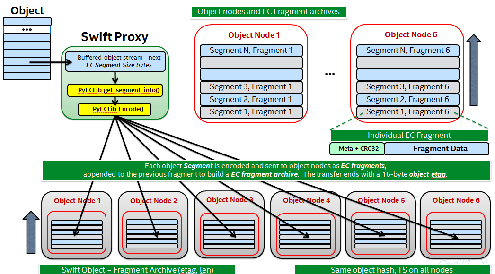
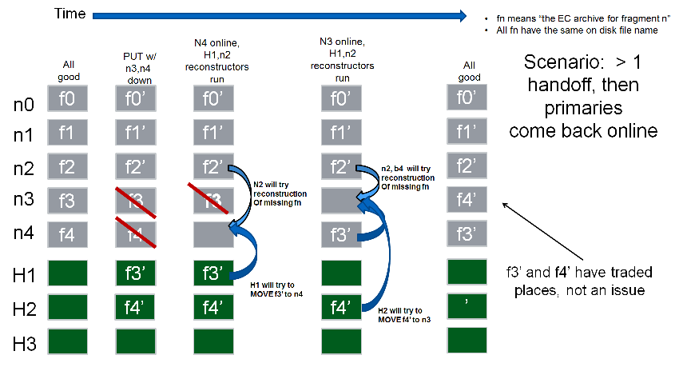
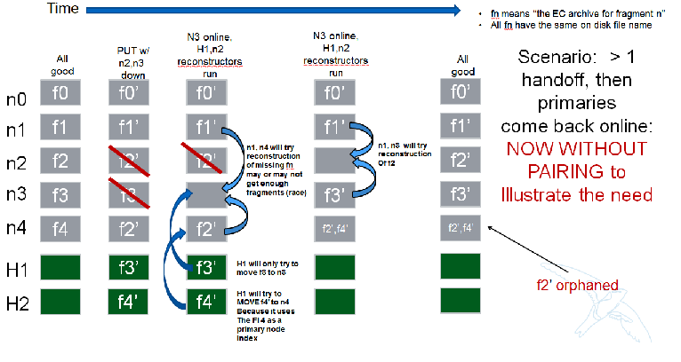
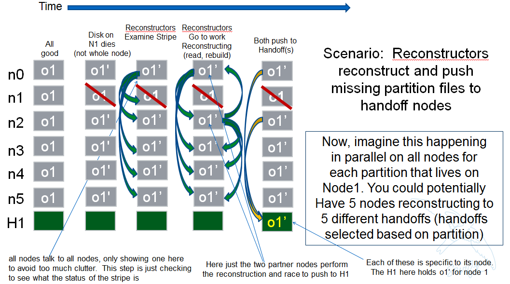
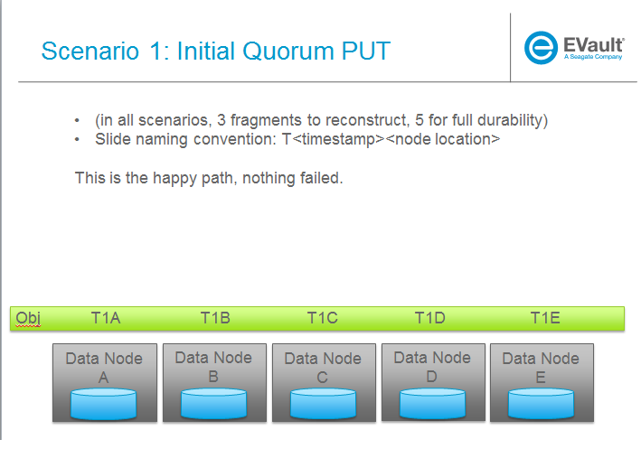
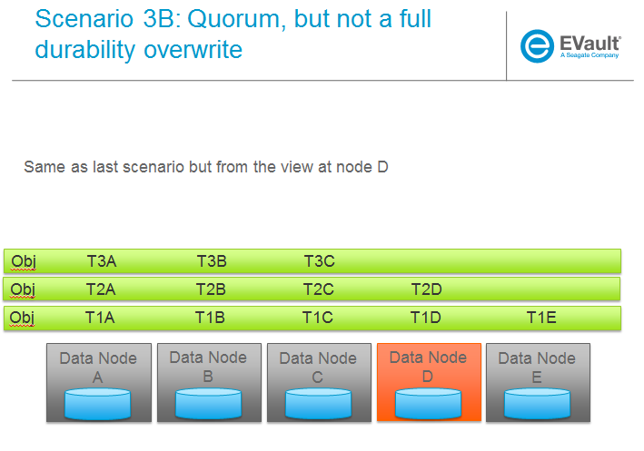

::

  This work is licensed under a Creative Commons Attribution 3.0
  Unported License.
  http://creativecommons.org/licenses/by/3.0/legalcode

====================
Erasure Code Support
====================

This is a living document to be updated as the team iterates on the design
therefore all details here reflect current thinking however are subject to
change as development progresses.  The team makes use of Trello to track
more real-time discussions activities that, as details/thoughts emerge, are
captured in this document.

The Trello discussion board can be found at this `link. <https://trello.com/b/LlvIFIQs/swift-erasure-codes>`_
Major remaining tasks are identified by a number that can be found in a corresponding Trello card.  Outstanding
tasks are listed at the end of each section in this document As this doc is updated and/or Trello cards are
completed please be sure to update both places.

WIP Revision History:

* 7/25, updated meta picture, specify that object metadata is system, redo reconstructor section
* 7/31, added traceability to trello cards via section numbers and numbered task items, added a bunch of sections
* 8/5, updated middleware section, container_sync section, removed 3.3.3.7 as dup, refactoring section, create common interface to proxy nodes, partial PUT hency on obj sysmet patch, sync'd with trello
* 8/23, many updates to reconstructor section based on con-call from 8/22.  Also added notes about not deleting on PUT where relevant and updated sections referencing closed Trello cards
* 9/4, added section in reconstructor on concurrency
* 10/7, reconstructor section updates - lots of them
* 10/14, more reconstructor section updates, 2 phase commit intro - misc typos as well from review
* 10/15, few clarifications from F2F review and bigger rewording/implementation change for what was called 2 phase commit
* 10/17, misc clarifying notes on .durable stuff
* 11/13: IMPORANT NOTE:  Several aspects of the reconstructor are being re-worked; the section will be updated ASAP

1. Summary
----------
EC is implemented in Swift as a Storage Policy, see `docs <http://docs.openstack.org/developer/swift/overview_policies.html>`_
for complete details on Storage Policies.

EC support impacts many of the code paths and background operations for data stored in a
container that was created with an EC policy however this is all transparent to users of
the cluster.  In addition to fully leveraging the Storage Policy framework, the EC design
will update the storage policy classes such that new policies, like EC, will be sub
classes of a generic base policy class.  Major code paths (PUT/GET) are updated to
accommodate the different needs to encode/decode versus replication and a new daemon, the
EC reconstructor, performs the equivalent jobs of the replicator for replication
processes.  The other major daemons remain, for the most part, unchanged as another key
concept for EC is that EC fragments (see terminology section below) are seen as regular
objects by the majority of services thus minimizing the impact on the existing code base.

The Swift code base doesn't include any of the algorithms necessary to perform the actual
encoding and decoding of data; that is left to an external library.  The Storage Policies
architecture is leveraged to allow EC on a per container basis and the object rings still
provide for placement of EC data fragments.  Although there are several code paths that are
unique to an operation associated with an EC policy, an external dependency to an Erasure Code
library is what Swift counts on to perform the low level EC functions.  The use of an external
library allows for maximum flexibility as there are a significant number of options out there,
each with its owns pros and cons that can vary greatly from one use case to another.

2. Problem description
======================

The primary aim of EC is to reduce the storage costs associated with massive amounts of data
(both operating costs and capital costs) by providing an option that maintains the same, or
better, level of durability using much less disk space.  See this `study <http://www.intel.com/content/dam/www/public/us/en/documents/white-papers/big-data-amplidata-storage-paper.pdf>`_
for more details on this claim.

EC is not intended to replace replication as it may not be appropriate for all usage models.
We expect some performance and network usage tradeoffs that will be fully characterized once
sufficient code is in place to gather empirical data.  Current thinking is that what is typically
referred to as 'cold storage' is the most common/appropriate use of EC as a durability scheme.

3. Proposed change
==================

3.1 Terminology
-----------------

The term 'fragment' has been used already to describe the output of the EC process (a series of
fragments) however we need to define some other key terms here before going any deeper.  Without
paying special attention to using the correct terms consistently, it is very easy to get confused
in a hurry!

* segment: not to be confused with SLO/DLO use of the work, in EC we call a segment a series of consecutive HTTP chunks buffered up before performing an EC operation.
* fragment: data and parity 'fragments' are generated when erasure coding transformation is applied to a segment.
* EC archive: A concatenation of EC fragments; to a storage node this looks like an object
* ec_k: number of EC data fragments (k is commonly used in the EC community for this purpose)
* ec_m: number of EC parity fragments (m is commonly used in the EC community for this purpose)
* chunk: HTTP chunks received over wire (term not used to describe any EC specific operation)
* durable: original data is available (either with or without reconstruction)
* quorum: the minimum number of data + parity elements required to be able to guarantee the desired fault tolerance, which is the number of data elements supplemented by the minimum number of parity elements required by the chosen erasure coding scheme. For example,for Reed-Soloman, the minimum number parity elements required is 1, and thus the quorum_size requirement is ec_ndata + 1.  Given the number of parity elements required is not the same for every erasure coding scheme, consult PyECLib for min_parity_fragments_needed()
* fully durable: all EC archives are written and available

3.2 Key Concepts
----------------

* EC is a Storage Policy with its own ring and configurable set of parameters.  The # of replicas for an EC ring is the total number of data plus parity elements configured for the chosen EC scheme.
* Proxy server buffers a configurable amount of incoming data and then encodes it via PyECLib we called this a 'segment' of an object.
* Proxy distributes the output of the encoding of a segment to the various object nodes it gets from the EC ring, we call these 'fragments' of the segment
* Each fragment carries opaque metadata for use by the PyECLib
* Object metadata is used to store meta about both the fragments and the objects
* An 'EC Archive' is what's stored on disk and is a collection of fragments appended
* The EC archives container metadata contains information about the original object, not the EC archive
* Here is a 50K foot overview:

3.3 Major Change Areas
----------------------

**Dependencies/Requirements**

See template section at the end

3.3.1 **Storage Policy Classes**

The feature/ec branch modifies how policies are instantiated in order to
Support the new EC policy.

`Trello <https://trello.com/b/LlvIFIQs/swift-erasure-codes>`_ Tasks for this section:

3.3.1.2: Make quorum a policy based function (IMPLEMENTED)

3.3.2 **Middleware**

Middleware remains unchanged. For most middleware (e.g., SLO/DLO) the fact that the
proxy is fragmenting incoming objects is transparent. For list endpoints, however, it
is a bit different. A caller of list endpoints will get back the locations of all of
the fragments. The caller will be unable to re-assemble the original object with this information,
however the node locations may still prove to be useful information for some applications.

3.3.3 **Proxy Server**

At this point in time it doesn't not appear that any major refactoring is required
to accommodate EC in the proxy, however that doesn't mean that its not a good
opportunity to review what options might make sense right now.  Discussions have included:

* should we consider a clearer line between handing incoming requests and talking to the back-end servers?
  Yes, it makes sense to do this.  There is a Trello card tracking this work and it covered in a section later below.
* should the PUT path be refactored just because its huge and hard to follow?
  Opportunistic refactoring makes sense however its not felt that it makes sense to
  combine a full refactor of PUT as part of this EC effort.
* should we consider different controllers (like an 'EC controller')?
  No, we don't want to do this.  Proxy is broken up by type of thing that needs to be
  processed - object, account, controller and not by how.  Its felt that this would get
  too messy and blur the architecture.

The following summarizes proxy changes to support EC:

*TODO:  there are current discussion underway on Trello that affect both of these flows*

**Basic flow for a PUT:**
    #. Proxy opens (ec_k + ec_m) backend requests to object servers
    #. Proxy buffers HTTP chunks up-to a minimum segment size (defined at 1MB to start with)
    #. Proxy feeds the assembled segment to PyECLib's encode() to get ec_k + ec_m fragments
    #. Proxy sends the (ec_k + ec_m) fragments to the object servers to be _appended_ to the previous set
    #. Proxy then continues with the next set of HTTP chunks
    #. Object servers store objects which are EC archives (their contents are the concatenation of erasure coded fragments)
    #. Object metadata changes: for 'etag', we store the md5sum of the EC archive object, as opposed to the non-EC case     where we store md5sum of the entire object
    #. Upon quorum of response and some minimal (2) number of commit confirmations, responds to client
    #. Upon receipt of the commit message (part of a MIME conversation) storage nodes store 0 byte data file as timestamp.durable for respective object

**Proxy HTTP PUT request handling changes**
    #. Intercept EC request based on policy type
    #. Validate ring replica count against (ec_k + ec_m)
    #. Calculate EC quorum size for min_conns
    #. Call into PyEClib to encode to client_chunk_size sized object chunks to generate (ec_k + ec_m) EC fragments.
    #. Queue chunk EC fragments for writing to nodes
    #. Introduce Multi-phase Commit Conversation

**Basic flow for a GET:**
    #. Proxy opens (ec_k + ec_m) backend concurrent requests to object servers. See Trello card 3.3.3.3
    #. Proxy would 1) validates the number of successful connections >= ec_k 2) checks the avaiable fragment archives responsed by obj-server are the same version.
       3) continue searching from the hand-off nodes (ec_k + ec_m) if not enough data found. See Trello card 3.3.3.6
    #. Proxy reads from the first ec_k fragment archives concurrently.
    #. Proxy buffers the content to a segment up-to the minimum segment size.
    #. Proxy feeds the assembled segment to PyECLib's decode() to get the original content.
    #. Proxy sends the original content to Client.
    #. Proxy then continues with the next segment of contents.

**Proxy HTTP GET request handling changes**

*TODO - add high level flow*

The GET path in the proxy currently does not make use of concurrent back-end connections like the
PUT path does (for obvious reason).  Because EC will require several GETs to collect fragments,
it makes sense for the GET path to get the connections going concurrently.

*Partial PUT handling*

When a previous PUT fails in the middle, for whatever reason and regardless of how the response
was sent to the client, there can be various scenarios at the object servers that require the
proxy to make some decisions about what to do.  Note that because the object servers will not
return data for .data files that don't have a matching .durable file, its not possible for
the proxy to get un-reconstrucable data unless there's a combination of a partial PUT and
a rebalance going on (or handoff scenario).  Here are the basic rules for the proxy when it
comes to interpreting its responses when they are mixed::

    If I have all of one timestamp, feed to PyECLib
        If PYECLib says OK
            I'm done, move on to next segment
        Else
            Fail the request (had sufficient segments but something bad happened)
    Else I have a mix of timestamps;
        Because they all have to be recosntructable, choose the newest
        Feed to PYECLib
        If PYECLib says OK
            Im done, move on to next segment
        Else
            Its possible that the newest timestamp I chose didn't have enough segments yet
            because, although each object server claims they're reconstructable, maybe
            a rebalance or handoff situation has resulted in some of those .data files
            residing elsewhere right now.  In this case, I want to look into the
            available timestamp headers that came back with the GET and see what else
            is reconstructable and go with that for now.  This is really a corner case
            because we will restrict moving partitions around such that enough archives
            should be found at any given point in time but someone might move too quickly
            so now the next check is...
            Choose the latest available timestamp in the headers and re-issue GET
            If PYECLib says OK
                I'm done, move on to next segment
            Else
                Fail the request (had sufficient segments but something bad happened) or
                we can consider going to the next latest header....

**Region Support**

For at least the initial version of EC, it is not recommended that an EC scheme span beyond a
single region,  Neither performance nor functional validation will be been done in in such
a configuration.

`Trello <https://trello.com/b/LlvIFIQs/swift-erasure-codes>`_ Tasks for this section::

* 3.3.3.5: CLOSED

* 3.3.3.9: Multi-Phase Commit Conversation

In order to help solve the local data file cleanup problem, a multi-phase commit scheme is introduced
for EC PUT operations (last few steps above).  The implementation will be via MIME documents such that
a conversation between the proxy and the storage nodes is had for every PUT.  This provides us with the
ability to handle a PUT in one connection and assure that we have "the essence" of a 2 phase commit,
basically having the proxy communicate back to the storage nodes once it has confirmation that all
fragment archives in the set have been committed.  Note that we still require a quorum of data elements
of the conversation to complete before signaling status to the client but we can relax that requirement
for the commit phase such that only 2 confirmations to that phase of the conversation are required for
success.  More will be said about this in the reconstructor section.

Now the storage node has a cheap indicator of the last known durable set of fragment archives for a given
object on a successful durable PUT.  The reconstructor will also play a role in the managing of the
.durable files, either propagating it or creating one post-reconstruction.  The presence of a ts.durable
file means, to the object server, "there is a set of ts.data files that are durable at timestamp ts."
See reconstructor section for more details and use cases on .durable files. Note that the completion
of the commit phase of the conversation is also a signal for the object server to go ahead and immediately
delete older timestamp files for this object (for EC they are not immediately deleted on PUT).  This is
critical as we don't want to delete the older object until the storage node has confirmation from the
proxy, via the multi-phase conversation, that the other nodes have landed enough for a quorum.

On the GET side, the implication here is that storage nodes will return the TS with a matching .durable
file even if it has a newer .data file.  If there exists a .data file on one node without a .durable file but
that same timestamp has both a .data and a .durable on another node, the proxy is free to use the .durable
timestamp series as the presence of just one .durable in the set indicates that the object has integrity. In
the even that a serires of .data files exist without a .durable file, they will eventually be deleted by the
reconstructor as they will be considered partial junk that is unreconstructable (recall that 2 .durables
are required for determining that a PUT was successful).

Note that the intention is that this section/trello card covers the multi-phase commit
implementation at both proxy and storage nodes however it doesn't cover the work that
the reconstructor does with the .durable file.

A few key points on the .durable file:

* the .durable file means "the matching .data file for this has sufficient fragment archives somewhere, committed, to reconstruct the object"
* the proxy server will never have knowledge (on GET or HEAD) or the existence of a .data file on an object server if it doesn't have a matching .durable file
* the object server will never return a ts.data that doesn't have a matching .durable
* the only component that messes with .data files that don't have matching .durable files is the reconstructor
* when a proxy does a GET, it will only receive fragment archives that have enough present somewhere to be reconstructed

3.3.3.8: Create common interface for proxy-->nodes

Creating a common module that allows for abstracted access to the a/c/s nodes would not only clean up
much of the proxy IO path but would also prevent the introduction of EC from further
complicating, for example, the PUT path.  Think about an interface that would let proxy code
perform generic actions to a back-end node regardless of protocol.  The proposed API
should be updated here and reviewed prior to implementation and its felt that it can be done
in parallel with existing EC proxy work (no dependencies, that work i small enough it can
be merged).

3.3.3.6: Object overwrite and PUT error handling

What's needed here is a mechanism to assure that we can handle partial write failures, more
specifically: ( Note:  in both cases the client will get a failure back however without additional changes,
each storage node that saved a EC fragment archive will effectively have an orphan.)

a) less than a quorum of nodes is written
b) quorum is met but not all nodes were written

and in both cases there are implications to both PUT and GET at both the proxy
and object servers.  Additionally, the reconstructor plays a role here in cleaning up
and old EC archives that result from the scheme described here (see reconstructor
for details).

**High Level Flow**

* If storing an EC archive fragment, the object server should not delete older .data file.  This patch is in review.
* When the object server handles a GET, it needs to send header to the proxy that include all available timestamps for the .data file
* If the proxy determines is can reconstruct the object with the latest timestamp (can reach quorum) it proceeds
* If quorum cant be reached, find timestamp where quorum can be reached, kill existing connections (unless the body of that request was the found timestamp), and make new connections requesting the specific timestamp
* On GET, the object server needs to support requesting a specific timestamp (eg ?timestamp=XYZ)

`Trello <https://trello.com/b/LlvIFIQs/swift-erasure-codes>`_ Tasks for this section::

* 3.3.3.1: CLOSED
* 3.3.3.2: Add high level GET flow
* 3.3.3.3: Concurrent connects to object server on GET path in proxy server
* 3.3.3.4: CLOSED
* 3.3.3.5: Region support for EC
* 3.3.3.6 EC PUTs should not delete old data files (in review)
* 3.3.3.7: CLOSED
* 3.3.3.8: Create common interface for proxy-->nodes
* 3.3.3.9: Multi-Phase Commit Conversation

3.3.4 **Object Server**

TODO - add high level flow

`Trello <https://trello.com/b/LlvIFIQs/swift-erasure-codes>`_ Tasks for this section::

* 3.3.4.1: Add high level Obj Serv modifications
* 3.3.4.2: Add trailer support (affects proxy too)

3.3.5 **Metadata**

Additional metadata is part of the EC design in a few different areas:

* New metadata is introduced in each 'fragment' that is opaque to Swift, it is used by PyECLib for internal purposes.
* New metadata is introduced as system object metadata as shown in this picture:

.. image:: images/meta.png

The object metadata will need to be stored as system metadata.

`Trello <https://trello.com/b/LlvIFIQs/swift-erasure-codes>`_ Tasks for this section::

* 5.1: Enable sysmeta on object PUT  (IMPLEMENTED)

3.3.6 **Database Updates**

We don't need/want container updates to be sent out by every storage node
participating in the EC set.  Current thinking is that if we limit the
number to the number of parity fragments for the scheme then we'll be on
par with replication.  Meaning, if you lose N nodes you can't do container
updates and the N for replication is just the replication factor where for
EC its the number of parity fragments.

For EC we'll base the number on the quorum value which is available via a
policy method. So, when its time to do account/container updates, only
X = (total - quorum) of the nodes participating in the EC scheme should actually
perform the updates.

To start with just the first X would work however there are likely some
optimizations in this are to explore during implementation including deciding
when we want to do the DB updates in the first place (see Trello discussion card
for more info)

`Trello <https://trello.com/b/LlvIFIQs/swift-erasure-codes>`_ Tasks for this section::

* 3.3.6.1: Acct/Cont DB Updates

3.3.7 **The Reconstructor**

**Overview**

The key concepts in the reconstructor design are:

*Focus on use cases that occur most frequently:*
    #. Recovery from disk drive failure
    #. Rebalance
    #. Ring changes and revertible handoff case
    #. Bit rot

* Reconstruction happens at the EC archive level (no visibility into fragment level for either auditing or reconstruction)
* Highly leverage ssync to gain visibility into which EC archive(s) are needed (some ssync mods needed, consider renaming the verb REPLICATION since ssync can be syncing in different ways now
* Minimal changes to existing replicator framework, auditor, ssync
* Implement as new reconstructor daemon (much reuse from replicator) as there will be some differences and we will want separate logging and daemon control/visibility for the reconstructor
* There is no required ordering between a fragment archive index and which primary/handoff node it lives on.
* Nodes in the list only act on their neighbors with regards to reconstruction (nodes don't talk to all other nodes)

**Reconstructor framework**

The current implementation thinking has the reconstructor live as its own daemon so
that it has independent logging and controls.  Its structure borrows heavily from
the replicator (ssync).

The reconstructor will need to do a few things differently than the replicator,
above and beyond the obvious EC functions.  Because each EC archive has
the same hash and filename, it can be a little confusing trying to trace through the
various failure scenarios.  The key point to understand is that a storage node
does not need to know which fragment archive index it is holding (most of the time)
because PyECLib will always do the right thing based on what fragments its been
given, recall that there is PyECLib specific metdata embedded in each fragment. The
only time when the fragment index is needed by the reconstructor is on update_delete().

Next Scenario:

**Ssync changes per spec sequence diagram**

The following picture shows what the ssync changes to enable reconstruction.

.. image:: images/recon.png

**Reconstructor local data file cleanup**

For the reconstructor cleanup is a bit different than replication because, for PUT consistency
reasons, the object server is going to keep the previous .data file (if it existed) just
in case the PUT of the most recent didn't complete successfully on a quorum of nodes.  That
leaves the replicator with many scenarios to deal with when it comes to cleaning up old files:

a) Assuming a PUT worked (commit recevied), the reconstructor will need to delete the older
timestamps on the local node.  This can be detected locally be examining the TS.data and
TS.durable filenames.  Any TS.data that is older than TS.durable can be deleted.

b) Assuming a quorum or better and the .durable file didn't make it to some nodes, the reconstructor
will detect this (different hashes, further examination shows presence of local .durable file and
remote matching ts files but not remote .durable) and simply push the .durable file to the remote
node, basically replicating it.

c) In the event that a PUT was only partially complete but was still able to get a quorum down,
the reconstructor will first need to reconstruct the object and then push the EC archives out
such that all participating nodes have one, then it can delete the older timestamps on the local
node.  Once the object is reconstructed, a TS.durable file is created and committed such that
each storage node has a record of the latest durable set much in the same way the multi-phase commit
works in PUT.

d) In the event that a PUT was only partially complete and did not get a quorum,
reconstruction is not possible.  The reconstructor therefore needs to delete these files
but there also must be an age factor to prevent it from deleting in flight PUTs. This should be
the default behavior but should be able to be overridden in the event that an admin may want
partials kept for some reason (easier DR maybe).  Regardless, logging when this happens makes a
lot of sense.  This scenario can be detected when the reconstructor attempts to reconstruct
because it notices it does not have a TS.durable for a particular TS.data and gets enough 409s
that it can't feed PyECLib enough data to reconstruct (it will need to feed PyECLib what it gets
and PYECLib will tell it if there's not enough though).  Whether we delete the .data file, mark it
somehow so we don't keep trying to reconstruct is TBD.

**Reconstructor rebalance**

Current thinking is that there should be no special handling here above and beyond the changes
described in the handoff reversion section.  From the view of the reconstructor these opeartions
are the same.  The scenario shown below is an example of what can happen during rebalance.

.. image:: images/rebal.png

**Reconstructor handoff reversion**

An update_delete() can shuffle fragment archives such that their indices no longer
line up with their fragment archives.  This can happen as a result of either handoff reversion or
a rebalance and the design described here addresses both and has no limitations on the number
of fragment archives that get shuffled.  See the previous section on rebalance for a picture
of how shuffling can happen.  The following algorithm assures that each fragment that needs to
be moved to a new node, ends up in a unique location.

In update_delete() processing, the reconstructor will HEAD the fragment archive in question
at all nodes in the node list provided in the job and use fragment indices as to index into
an array where the node_id from the job at that position.  For nodes that do not have
the fragment archive present, a placeholder is left in the array.  After all nodes have
been heard from, those without a fragment archive are placed in order into the placeholder
positions in the array.

The reconstructor then gets the metadata from the local fragment archive and uses it as an
index into the array to determine which node it should move its local fragment archive to.

In this manner, each reconstructor running an update_delete() job is performing a minimal
HEAD to the rest of the nodes and using this data, along with its local information to assure
independent unique placement (movement) of the fragment archive that it is moving.

In the example described in the rebalance section, the following would be created:

building up: [0, 1, 2, -1, -1]

after hearing from all nodes, adding in nodes without archives in order; [0, 1, 2, 5, 6]

and then node3 would see that it has fragment index 3 so choose the 4th location in the
dictionary, dummy1, and select node5.  Node4 should choose the 5th location, node6.

TODO:  the example above could be a little clearer (more nodes, things with mixed order
in the middle of the list instead of at the end...)

**Reconstructor concurrency**

There are 2 aspects of concurrency to consider with the reconstructor:

1) concurrency of the daemon

This means the same for the reconstructor as it does for the replicator, the
size of the GreenPool used for the 'update' and 'update_deleted' jobs.

2) overall parallelism of partition reconstruction

With regards to node-node communication we have already covered the notion that
the reconstructor cannot simply check in with its neighbors to determine what
action is should take, if any, on its current run because it needs to know the
status of the full stripe (not just the status of one or two other EC archives).

However, we do not want it to actually take action on all other nodes.  In other
words, we do want to check in with every node to see if a reconstruction is needed
and in the event that it is, we dont want to attempt reconstruction on partner
nodes, its left and right neighbors.  This will minimize reconstruction races but
still provide for redundancy in addressing the reconstruction of an EC archive.

In the event that a node (HDD) is down, there will be 2 partners for that node per
partition working the reconstruction thus if we had 6 primaries, for example,
and an HDD dies on node 1.  We only want nodes 0 and 2 to add jobs to their local
reconstructor even though when they call obj_ring.get_part_nodes(int(partition))
to get a list of other members of the stripe they will get back 6 nodes.  The local
node will make its decision as to whether to add a reconstruction job or not based
on its position in the node list.

In doing this, we minimize the reconstruction races but still enable all 6 nodes to be
working on reconstruction for a failed HDD as the partitions will be distributed
amongst all of the nodes therefore the node with the dead HDD will potentially have
all other nodes pushing reconstructed EC archives to the handoff node in parallel on
different partitions with every partition having at most 2 nodes racing to reconstruct
its archives.

The following picture illustrates the example above.

**SCENARIOS:**

The following series of pictures illustrate the various scenarios more completely.  We will use
these scenarios against each of the main functions of the reconstructor which we will define as:

#. Reconstructor framework (daemon)
#. Reconstruction (Ssync changes per spec sequence diagram)
#. Reconstructor local data file cleanup
#. Rebalance
#. Handoff reversion (move data back to primary)

*TODO: Once designs are proposed for each of the main areas above, map to scenarios below for completeness.*

.. image:: images/recons2.png
.. image:: images/recons3.png

.. image:: images/recons5.png
.. image:: images/recons6.png
.. image:: images/recons7.png
.. image:: images/recons8.png
.. image:: images/recons9.png
.. image:: images/recons10.png

`Trello <https://trello.com/b/LlvIFIQs/swift-erasure-codes>`_ Tasks for this section::

* 3.3.7.1: Reconstructor framework
* 3.3.7.2: Ssync changes per spec sequence diagram
* 3.3.7.3: Reconstructor local data file cleanup
* 3.3.7.4: Node to node communication and synchrinozation on stripe status
* 3.3.7.5: Reconstructor rebalance
* 3.3.7.6: Reconstructor handoff reversion
* 3.3.7.7: Add conf file option to never delete un-reconstructable EC archives

3.3.8 **Auditor**

Because the auditor already operates on a per storage policy basis, there are no specific
auditor changes associated with EC.  Each EC archive looks like, and is treated like, a
regular object from the perspective of the auditor.  Therefore, if the auditor finds bit-rot
in an EC archive, it simply quarantines it and the EC reconstructor will take care of the rest
just as the replicator does for replication policies.  Because quarantine directories are
already isolated per policy, EC archives have their own quarantine directories.

3.3.9 **Performance**

Lots of considerations, planning, testing, tweaking, discussions, etc., etc. to do here

`Trello <https://trello.com/b/LlvIFIQs/swift-erasure-codes>`_ Tasks for this section::

* 3.3.9.1: Performance Analysis

3.3.10 **The Ring**

I think the only real thing to do here is make rebalance able to move more than 1 replica of a
given partition at a time. In my mind, the EC scheme is stored in swift.conf, not in the ring,
and the placement and device management doesn't need any changes to cope with EC.

We also want to scrub ring tools to use the word "node" instead of "replicas" to avoid
confusion with EC.

`Trello <https://trello.com/b/LlvIFIQs/swift-erasure-codes>`_ Tasks for this section::

* 3.3.10.1:  Ring changes

3.3.11 **Testing**

Since these tests aren't always obvious (or possible) on a per patch basis (because of
dependencies on other patches) we need to document scenarios that we want to make sure
are covered once the code supports them.

3.3.11.1 **Probe Tests**

The `Trello <https://trello.com/b/LlvIFIQs/swift-erasure-codes>`_ card for this has a good
starting list of test scenarios, more should be added as the design progresses.

3.3.11.2 **Functional Tests**

To begin with at least, it believed we just need to make an EC policy the default
and run existing functional tests (and make sure it does that automatically)

`Trello <https://trello.com/b/LlvIFIQs/swift-erasure-codes>`_ Tasks for this section::

* 3.3.11.1: Required probe test scenarios
* 3.3.11.2: Required functional test scenarios

3.3.12 **Container Sync**

Container synch assumes the use of replicas. In the current design, container synch from an EC
policy would send only one fragment archive to the remote container, not the reconstructed object.

Therefore container sync needs to be updated to use an internal client instead of the direct client
that would only grab a fragment archive.

`Trello <https://trello.com/b/LlvIFIQs/swift-erasure-codes>`_ Tasks for this section::

* 3.3.12.1: Container synch from an EC containers

3.3.13 **EC Configuration Helper Tool**

Script to include w/Swift to help determine what the best EC scheme might be and what the
parameters should be for swift.conf.

`Trello <https://trello.com/b/LlvIFIQs/swift-erasure-codes>`_ Tasks for this section::

* 3.3.13.1: EC Configuration Helper Tool

3.3.14 **SAIO Updates**

We want to make sure its easy for the SAIO environment to be used for EC development
and experimentation.  Just as we did with policies, we'll want to update both docs
and scripts once we decide what exactly what we want it to look like.

For now lets start with 6 total nodes and a 2+2+2 scheme (2 data, 2 parity, 2 handoffs)

`Trello <https://trello.com/b/LlvIFIQs/swift-erasure-codes>`_ Tasks for this section::

* 3.3.13.1: SAIO Updates

3.4 Alternatives
----------------

This design is 'proxy centric' meaning that all EC is done 'in line' as we bring data in/out of
the cluster.  An alternate design might be 'storage node centric' where the proxy is really
unaware of EC work and new daemons move data from 3x to EC schemes based on rules that could
include factors such as age and size of the object.  There was a significant amount of discussion
on the two options but the former was eventually chosen for the following main reasons:

EC is CPU/memory intensive and being 'proxy centric' more closely aligns with how providers are
planning/have deployed their HW infrastructure

Having more intelligence at the proxy and less at the storage node is more closely aligned with
general Swift architectural principles

The latter approach was limited to 'off line' EC meaning that data would always have to make the
'trip' through replication before becoming erasure coded which is not as usable for many applications

The former approach provides for 'in line' as well as 'off line' by allowing the application
to store data in a replication policy first and then move that data at some point later to EC by
copying the data to a different container.  There are thoughts/ideas for alternate means for
allowing a data to change the policy of a container that are not covered here but are recognized to
be possible with this scheme making it even easier for an application to control the data durability
policy.

*Alternate Reconstructor Design*

An alternate, but rejected, proposal is archived on `Trello. <https://trello.com/b/LlvIFIQs/swift-erasure-codes>`_

Key concepts for the REJECTED proposal were:

Perform auditing at the fragment level (sub segment) to avoid having the smallest unit of work be an EC archive.  This will reduce reconstruction network traffic

Today the auditor quarantines an entire object, for fragment level rebuild we
need an additional step to identify which fragment within the archive is bad and
potentially quarantine in a different location to project the archive from deletion
until the Reconstructor is done with it

Today hashes.pkl only identifies a suffix directory in need of attention.  For
fragment level rebuild, the reconstructor needs to have additional information as
its not just syncing at the directory level:
Needs to know which fragment archive in the suffix dir needs work
Needs to know which segment index within the archive is bad
Needs to know the fragment index of the archive (the EC archives position within the set)

Perform reconstruction on the local node, however preserve the push model by having the
remote node communicate reconstruction information via a new verb. This will reduce reconstruction
network traffic. This could be really bad wrt overloading the local node with reconstruction
traffic as opposed to using all the compute power of all systems participating in the partitions
kept on the local node.

*Alternate Reconstructor Design #2*

The design proposal leverages the REPLICATE verb but introduces a new hashes.pkl format
for EC and, for readability, names this file ec_hashes.pkl.  The contents of this file will be
covered shortly but it essentially needs to contain everything that any node would need to know
in order to make a pass over its data and decided whether to reconstruct, delete, or move data.
So, for EC, the standard hashes.pkl file and/or functions that operate on it are not relevant.

The data in ec_hashes.pkl has the following properties:

* needs to be synchronized across all nodes
* needs to have complete information about any given object hash to be valid for that hash
* can be complete for some object hashes and incomplete for others

There are many choices for achieving this ranging from gossip methods to consensus schemes. The
proposed design leverages the fact that all nodes have access to a common structure and accessor
functions that are assumed to be synchronized (eventually) such that any node position in the list
can be used to select a master for one of two operations that require node-node communication:
(1) ec_hashes.pkl synchronization and (2) reconstruction.

*ec_hashes.pkl synchronization*

At any given point in time there will be one node out of the set of nodes returned from
get_part_nodes() that will act as the master for synchronizing ec_hashes.pkl information.  The
reconstructor, at the start of each pass, will use a bully style algorithm to elect the hash master.
When each reconstructor starts a pass it will send an election message to all nodes with a node
index lower than its own.  If unable to connect with said nodes then it assumes the role of
hash master.  If any nodes with lower index reply then it continues with the current pass,
processing its objects baed on current information in its ec_hashes.pkl.  This bully-like
algoithm won't actually prevent 2 masters from running at the same time (for example nodes 0-2
could all be down so node 3 starts as master and then one of the nodes comes back up, it will
also start the hash synchronization process).  Note that this does not cause functional issues,
its just a bit wasteful but saves us from implementing a more complex consensus algorithm
thats not deemed to be worth the effort.

The role of the master will be to:

#. send REPLCIATE to all other nodes in the set
#. merge results
#. send new variation of REPLICATE to all other nodes
#. nodes merge into their ec_hashes.pkl

In this manner there will be typically one node sending 2 REPLICATE verbs to n other nodes
for each pass of the reconstructor so a total of 2(n-1) REPLICATE so O(n) versus O(1) for
replication where 3 nodes would be sending 2 messages each for a constant 6 messages per
pass.  Note that there are distinct differences between the merging done by the master
after collecting node pkl files and the merging done at the nodes after receiving the
master version.  When the master is merging, it is only updating the master copy with
new information about the sending node.  When a node is merging from master, it is only
updating information about all other nodes.  In other words, the master is only interested
in hearing information from a node about that node itself and any given node is only
interested in learning about everybody else.  More on these merging rules later.

At any given point in time the ec_hashes.pkl file on a node can be in a variety of states, it
is not required that, although a synchronized set was sent by the master, that the synchronized
version be inspected by participating nodes.  Each object hash within the ec_hashes.pkl will
have information indicating whether that particular entry is synchronized or not, therefore it
may be the case that a particular pass of a reconstructor run parse an ec_hashes.pkl file and
only find some percentage N of synchronized entries where N started at 100% and dropped from there
as changes were made to the local node (objects added, objects quarantined).  An example will
be provided after defining the format of the file.

ec_hashes data structure

{object_hash_0: {TS_0: [node0, node1, ...], TS_n: [node0, node1, ...], ...},
 object_hash_1: {TS_0: [node0, node1, ...], TS_n: [node0, node1, ...], ...},
 object_hash_n: {TS_0: [node0, node1, ...], TS_n: [node0, node1, ...], ...}}

where nodeX takes on values of unknown, not present or present such that a reconstructor
parsing its local structure can determine on an object by object basis which TS files
exist on which nodes, which ones it is missing on or if it has incomplete information for
that TS (a node value for that TS is marked as unknown).  Note that although this file format
will contain per object information, objects are removed from the file by the local nodes
once the local node has *seen* information from all other nodes for that entry.  Therefore
the file will not contain an entry for every object in the system but instead a transient
entry for every object while its being accepted into the system (having its consistency wrt
EC verified).

The new ec_hashes.pkl is subject to several potential writers including the hash master,
its own local reconstructor, the auditor, the PUT path, etc., and will therefore be using
the same locking that hashes.pkl uses today.  The following illustrates the ongoing
updates to ec_hashes.pkl

.. image:: images/ec_pkl_life.png

As the ec_hashes.pkl file is updated, the following rules apply:

As a **hash master** updating a local master file with any single node file:
(recall the goal here is to update the master with info about the incoming node)

* data is never deleted (ie if an object hash or TS key exists in master but does not in the incoming dictionary, the entry is left in tact)
* data can be added (if an object hash or TS key exists in an incoming dicitonary but does not exist in master it is added)
* where keys match, only the node index in the TS list for the incoming data is affected and that data is replaced in master with the incoming information

As a **non-master** node merging from the master:
(recall that the goal here is to have this node learn the other nodes in the cluster)

* an object hash is deleted as soon as all nodes are maked present
* data can be added, same as above
* where keys match, only *other* the indicies in the TS list for the incoming data is affected and that data is replaced with the incoming information

**Some examples**

The following are some example scenarios (used later to help explain use cases) and their
corresponding ec_hashes data structures.

.. image:: images/echash1.png
.. image:: images/echash2.png

4. Implementation
=================

Assignee(s)
-----------

There are several key contributors, torgomatic is the core sponsor

Work Items
----------

See `Trello discussion board <https://trello.com/b/LlvIFIQs/swift-erasure-codes>`_

Repositories
------------

Using Swift repo

Servers
-------

N/A

DNS Entries
-----------

N/A

5. Dependencies
===============

As mentioned earlier, the EC algorithms themselves are implemented externally in
multiple libraries.  See the main site for the external work at `PyECLib <https://bitbucket.org/kmgreen2/pyeclib>`_

PyECLib itself is already an accepted `requirement. <https://review.openstack.org/#/c/76068/>`_

Work is ongoing to make sure that additional package depend ices for PyECLib are ongoing...
There is a linux package, liberasurecode, that is also being developed as part of this effort
and is needed by PyECLib.  Getting it added for devstack tempest tests and unittests slaves is
currently WIP by tsg

`Trello <https://trello.com/b/LlvIFIQs/swift-erasure-codes>`_ Tasks for this section::

* 5.1: Enable sysmeta on object PUT  (IMPLEMENTED)
