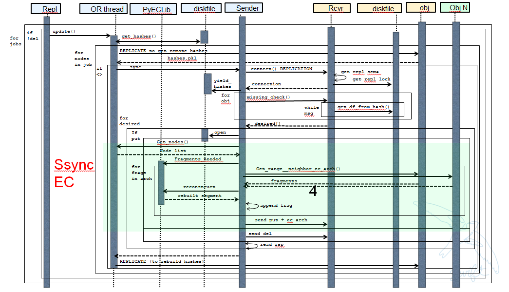
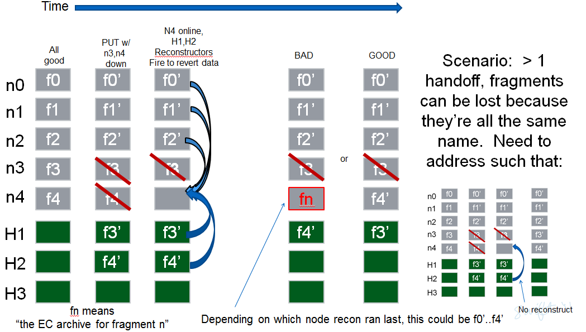
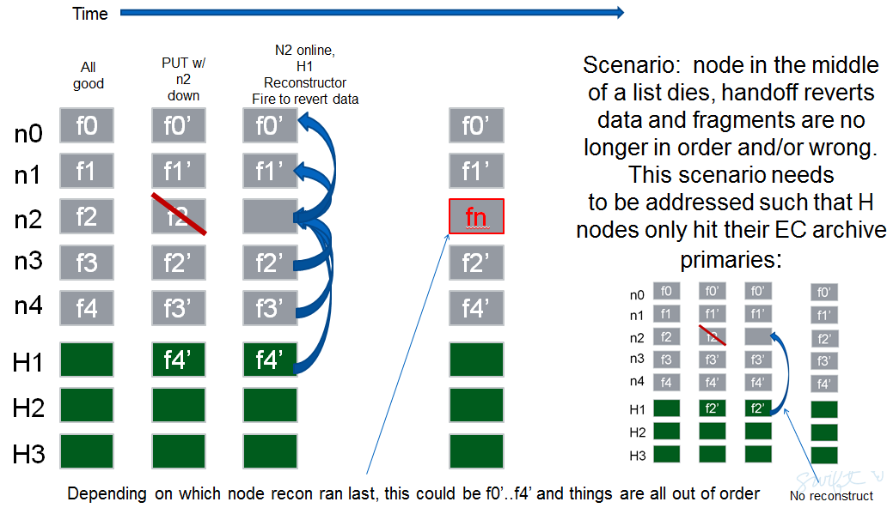

::

  This work is licensed under a Creative Commons Attribution 3.0
  Unported License.
  http://creativecommons.org/licenses/by/3.0/legalcode

====================
Erasure Code Support
====================

This is a living document to be updated as the team iterates on the design
therefore all details here reflect current thinking however are subject to
change as development progresses.  The team makes use of Trello to track
more real-time discussions activities that, as details/thoughts emerge, are
captured in this document.

The Trello discussion board can be found at this `link. <https://trello.com/b/LlvIFIQs/swift-erasure-codes>`_
Major remaining tasks are identified by a number that can be found in a corresponding Trello card.  Outstanding
tasks are listed at the end of each section in this document As this doc is updated and/or Trello cards are
completed please be sure to update both places.

WIP Revision History:

* 7/25, updated meta picture, specify that object metadata is system, redo reconstructor section
* 7/31, added traceability to trello cards via section numbers and numbered task items, added a bunch of sections

1. Summary
----------
EC is implemented in Swift as a Storage Policy, see `docs <http://docs.openstack.org/developer/swift/overview_policies.html>`_
for complete details on Storage Policies.

EC support impacts many of the code paths and background operations for data stored in a
container that was created with an EC policy however this is all transparent to users of
the cluster.  In addition to fully leveraging the Storage Policy framework, the EC design
will update the storage policy classes such that new policies, like EC, will be sub
classes of a generic base policy class.  Major code paths (PUT/GET) are updated to
accommodate the different needs to encode/decode versus replication and a new daemon, the
EC reconstructor, performs the equivalent jobs of the replicator for replication
processes.  The other major daemons remain, for the most part, unchanged as another key
concept for EC is that EC fragments (see terminology section below) are seen as regular
objects by the majority of services thus minimizing the impact on the existing code base.

The Swift code base doesn't include any of the algorithms necessary to perform the actual
encoding and decoding of data; that is left to an external library.  The Storage Policies
architecture is leveraged to allow EC on a per container basis and the object rings still
provide for placement of EC data fragments.  Although there are several code paths that are
unique to an operation associated with an EC policy, an external dependency to an Erasure Code
library is what Swift counts on to perform the low level EC functions.  The use of an external
library allows for maximum flexibility as there are a significant number of options out there,
each with its owns pros and cons that can vary greatly from one use case to another.

2. Problem description
======================

The primary aim of EC is to reduce the storage costs associated with massive amounts of data
(both operating costs and capital costs) by providing an option that maintains the same, or
better, level of durability using much less disk space.  See this `study <http://www.intel.com/content/dam/www/public/us/en/documents/white-papers/big-data-amplidata-storage-paper.pdf>`_
for more details on this claim.

EC is not intended to replace replication as it may not be appropriate for all usage models.
We expect some performance and network usage tradeoffs that will be fully characterized once
sufficient code is in place to gather empirical data.  Current thinking is that what is typically
referred to as 'cold storage' is the most common/appropriate use of EC as a durability scheme.

3. Proposed change
==================

3.1 Terminology
-----------------

The term 'fragment' has been used already to describe the output of the EC process (a series of
fragments) however we need to define some other key terms here before going any deeper.  Without
paying special attention to using the correct terms consistently, it is very easy to get confused
in a hurry!

* segment: not to be confused with SLO/DLO use of the work, in EC we call a segment a series of consecutive HTTP chunks buffered up before performing an EC operation.
* fragment: data and parity 'fragments' are generated when erasure coding transformation is applied to a segment.
* EC archive: A concatenation of EC fragments; to a storage node this looks like an object
* ec_k - number of EC data fragments (k is commonly used in the EC community for this purpose)
* ec_m - number of EC parity fragments (m is commonly used in the EC community for this purpose)
* chunk: HTTP chunks received over wire (term not used to describe any EC specific operation)

3.2 Key Concepts
----------------

* EC is a Storage Policy with its own ring and configurable set of parameters.  The # of replicas for an EC ring is the total number of data plus parity elements configured for the chosen EC scheme.
* Proxy server buffers a configurable amount of incoming data and then encodes it via PyECLib we called this a 'segment' of an object.
* Proxy distributes the output of the encoding of a segment to the various object nodes it gets from the EC ring, we call these 'fragments' of the segment
* Each fragment carries opaque metadata for use by the PyECLib
* Object metadata is used to store meta about both the fragments and the objects; we call an object, as stored on node, an 'EC Archive' and needs to be system metadata.  `This patch <https://review.openstack.org/#/c/79991/>`_ introduces system object metadata
* The EC archives container metadata contains information about the original object, not the EC archive
* Here is a 50K foot overview:

.. image:: images/overview.png

3.3 Major Change Areas
----------------------

**Dependencies/Requirements**

See template section at the end

3.3.1 **Storage Policy Classes**

This `patch <https://review.openstack.org/#/c/103644/>`_ introduces
the EC policy itself as well as adds general extensibility for other policies
to subclass the policy base class.  See patch for full details.  A follow-up
patch will move quorum_size() to be a policy specific function.

`Trello <https://trello.com/b/LlvIFIQs/swift-erasure-codes>`_ Tasks for this section::

* 3.3.1.1: Add base EC storage policy
* 3.3.1.2: Make quorum a policy based function

3.3.2 **Middleware**

Current thinking:  no middleware impact

`Trello <https://trello.com/b/LlvIFIQs/swift-erasure-codes>`_ Tasks for this section::

* 3.3.2.1: Middleware Impact

3.3.3 **Proxy Server**

At this point in time it doesn't not appear that any major refactoring is required
to accommodate EC in the proxy, however that doesn't mean that its not a good
opportunity to review what options might make sense right now.  For example:

* should we consider a clearer line between handing incoming requests and talking to the back-end servers?
* should the PUT path be refactored just because its huge and hard to follow?
* should we consider different controllers (like an 'EC controller')?

The following summarizes proxy changes to support EC:

*Basic flow for a PUT:*
    #. Proxy opens (ec_k + ec_m) backend requests to object servers
    #. Proxy buffers HTTP chunks up-to a minimum segment size (defined at 1MB to start with)
    #. Proxy feeds the assembled segment to PyECLib's encode() to get ec_k + ec_m fragments
    #. Proxy sends the (ec_k + ec_m) fragments to the object servers to be _appended_ to the previous set
    #. Proxy then continues with the next set of HTTP chunks
    #. Object servers store objects which are EC archives (their contents are the concatenation of erasure coded fragments)
    #. Object metadata changes: for 'etag', we store the md5sum of the EC archive object, as opposed to the non-EC case     where we store md5sum of the entire object

*Proxy HTTP PUT request handling changes*
    #. Intercept EC request based on policy type
    #. Validate ring replica count against (ec_k + ec_m)
    #. Calculate EC quorum size for min_conns
    #. Call into PyEClib to encode to client_chunk_size sized object chunks to generate (ec_k + ec_m) EC fragments.
    #. Queue chunk EC fragments for writing to nodes

*Basic flow for a GET:*

*Proxy HTTP GET request handling changes*

TODO - add high level flow

The GET path in the proxy currently does not make use of concurrent back-end connections like the
PUT path does (for obvious reason).  Because EC will require several GETs to collect fragments,
it makes sense for the GET path to get the connections going concurrently.

*iter_nodes() changes*

EC will require that node lists stay in order with respect to EC fragment archives.  See the
section on reconstructor for pictures as to why this is required.  In order to achieve this,
the proxy iter_nodes() function needs to be modified (or replaced) for EC policies such that:
(a) it does not shuffle/sort the node list and (b) handoffs take the place, within the node list,
of the primary that they are covering for.

*Region Support*

Discussion topic for how we want to support this.  Yuan has suggested read/write affinity changes
but there was also some talk about wanting to keep EC policies limited to single region to start
with.  Need to determine what makes sense here.

`Trello <https://trello.com/b/LlvIFIQs/swift-erasure-codes>`_ Tasks for this section::

* 3.3.3.1: Refactoring discussions
* 3.3.3.2: Add high level GET flow
* 3.3.3.3: Concurrent connects to object server on GET path in proxy server
* 3.3.3.4: iter_nodes() changes for EC
* 3.3.3.5: Region support for EC
* 3.3.3.6: Object overwrite and PUT error handling
* 3.3.3.7: Revive abandoned patch and propose to feature/ec

3.3.4 **Object Server**

TODO - add high level flow

`Trello <https://trello.com/b/LlvIFIQs/swift-erasure-codes>`_ Tasks for this section::

* 3.3.4.1: Add high level Obj Serv modifications
* 3.3.4.2: Add trailer support (affects proxy too)

3.3.5 **Metadata**

Additional metadata is part of the EC design in a few different areas:

* New metadata is introduced in each 'fragment' that is opaque to Swift, it is used by PyECLib for internal purposes.
* New metadata is introduced as system object metadata (pic doesn't show it as sysmeta but it will be) as shown in this picture:

.. image:: images/meta.png

The object metadata will need to be stored as system metadata so we have
a `dependency <https://review.openstack.org/#/c/799918/>`_

`Trello <https://trello.com/b/LlvIFIQs/swift-erasure-codes>`_ Tasks for this section::

* 5.1: Enable sysmeta on object PUT  (from the dependencies section)

3.3.6 **Database Updates**

We don't need/want container updates to be sent out by every storage node
participating in the EC set.  Current thinking is that if we limit the
number to the number of parity fragments for the scheme then we'll be on
par with replication.  Meaning, if you lose N nodes you can't do container
updates and the N for replication is just the replication factor where for
EC its the number of parity fragments.  Which N and the specific
implementation is TBD.

`Trello <https://trello.com/b/LlvIFIQs/swift-erasure-codes>`_ Tasks for this section::

* 3.3.6.1: Acct/Cont DB Updates

3.3.7 **The Reconstructor**

The key concepts in the reconstructor design are:

*Focus on use cases that occur most frequently:*
    #. Recovery from disk drive failure
    #. Rebalance
    #. Ring changes and revertible handoff case
    #. Bit rot

* Reconstruction happens at the EC archive level (no visibility into fragment level for either auditing or reconstruction)
* Highly leverage ssync to gain visibility into which EC archive(s) need repair (some ssync mods needed, consider renaming the verb REPLICATION since ssync can be syncing in different ways now
* Minimal changes to replicator framework, auditor, ssync
* Implement as new reconstructor daemon (much reuse from replicator) as there will be some differences and we will want separate logging and daemon control/visibility for the reconstructor
* Require PUT to assure EC archives are placed in order on primary nodes (2 changes, no sorting in iter_nodes and the current PUT path concurrent method for puts needs to assure order as well)
* Handoff nodes only revert data to its primary node or another handoff (not to any old primary)
* Handoff nodes do not overwrite existing EC archives when reverting data

The current implementation thinking has the reconstructor live as its own daemon so
that it has independent logging and controls.  Its structure will borrow heavily from
the replicator.  It will use ssync for updates and rsync for reverting data from handoff
nodes.

The following picture shows what the ssync changes to enable reconstruction.

The reconstructor will need to do a few things differently than the replicator,
above and beyond the obvious EC functions.  Because each EC archive has
the same hash and filename, care must be taken to assure that the correct
EC archive is used in various operations so we do not end up putting the wrong
one somewhere during data movement following a handoff no longer being needed.
The following figures show 2 examples of what could happen if we adopt the
existing replicator mechanism for handoff reversion.

An alternate, but rejected, proposal is archived on `Trello. <https://trello.com/b/LlvIFIQs/swift-erasure-codes>`_

Key concepts for the REJECTED proposal were:

Perform auditing at the fragment level (sub segment) to avoid having the smallest unit of work be an EC archive.  This will reduce reconstruction network traffic

Today the auditor quarantines an entire object, for fragment level rebuild we
need an additional step to identify which fragment within the archive is bad and
potentially quarantine in a different location to project the archive from deletion
until the Reconstructor is done with it

Today hashes.pkl only identifies a suffix directory in need of attention.  For
fragment level rebuild, the reconstructor needs to have additional information as
its not just syncing at the directory level:
Needs to know which fragment archive in the suffix dir needs work
Needs to know which segment index within the archive is bad
Needs to know the fragment index of the archive (the EC archives position within the set)

Perform reconstruction on the local node, however preserve the push model by having the
remote node communicate reconstruction information via a new verb. This will reduce reconstruction
network traffic. This could be really bad wrt overloading the local node with reconstruction
traffic as opposed to using all the compute power of all systems participating in the partitions
kept on the local node.

`Trello <https://trello.com/b/LlvIFIQs/swift-erasure-codes>`_ Tasks for this section::

* 3.3.7.1: Reconstructor framework
* 3.3.7.2: Ssync changes per spec sequence diagram

3.3.8 **Auditor**

Because the auditor already operates on a per storage policy basis, there are no specific
auditor changes associated with EC.  Each EC archive looks like, and is treated like, a
regular object from the perspective of the auditor.  Therefore, if the auditor finds bit-rot
in an EC archive, it simply quarantines it and the EC reconstructor will take care of the rest
just as the replicator does for replication policies.  Because quarantine directories are
already isolated per policy, EC archives have their own quarantine directories.

3.3.9 **Performance**

Lots of considerations, planning, testing, tweaking, discussions, etc., etc. to do here

`Trello <https://trello.com/b/LlvIFIQs/swift-erasure-codes>`_ Tasks for this section::

* 3.3.9.1: Performance Analysis

3.3.10 **The Ring**

I think the only real thing to do here is make rebalance able to move more than 1 replica of a
given partition at a time. In my mind, the EC scheme is stored in swift.conf, not in the ring,
and the placement and device management doesn't need any changes to cope with EC.

(Don't let the word "replica" confuse you; that's what the builder calls it internally.
We're still talking EC here.)

`Trello <https://trello.com/b/LlvIFIQs/swift-erasure-codes>`_ Tasks for this section::

* 3.3.10.1: Potential ring changes

3.3.11 **Testing**

Since these tests aren't always obvious (or possible) on a per patch basis (because of
dependencies on other patches) we need to document scenarios that we want to make sure
are covered once the code supports them.

`Trello <https://trello.com/b/LlvIFIQs/swift-erasure-codes>`_ Tasks for this section::

* 3.3.11.1: Required probe test scenarios
* 3.3.11.2: Required functional test scenarios

3.3.12 **Container Sync**

Container synch assumes the use of replicas. In the current design, container synch from an EC
policy would send only one fragment archive to the remote container, not the reconstructed object.

`Trello <https://trello.com/b/LlvIFIQs/swift-erasure-codes>`_ Tasks for this section::

* 3.3.12.1: Container synch from an EC containers

3.3.13 **EC Configuration Helper Tool**

Script to include w/Swift to help determine what the best EC scheme might be and what the
parameters should be for swift.conf.

`Trello <https://trello.com/b/LlvIFIQs/swift-erasure-codes>`_ Tasks for this section::

* 3.3.13.1: EC Configuration Helper Tool

3.3.14 **SAIO Updates**

We want to make sure its easy for the SAIO environment to be used for EC development
and experimentation.  Just as we did with policies, we'll want to update both docs
and scripts once we decide what exactly what we want it to look like.

`Trello <https://trello.com/b/LlvIFIQs/swift-erasure-codes>`_ Tasks for this section::

* 3.3.13.1: SAIO Updates

3.4 Alternatives
----------------

This design is 'proxy centric' meaning that all EC is done 'in line' as we bring data in/out of
the cluster.  An alternate design might be 'storage node centric' where the proxy is really
unaware of EC work and new daemons move data from 3x to EC schemes based on rules that could
include factors such as age and size of the object.  There was a significant amount of discussion
on the two options but the former was eventually chosen for the following main reasons:

EC is CPU/memory intensive and being 'proxy centric' more closely aligns with how providers are
planning/have deployed their HW infrastructure

Having more intelligence at the proxy and less at the storage node is more closely aligned with
general Swift architectural principles

The latter approach was limited to 'off line' EC meaning that data would always have to make the
'trip' through replication before becoming erasure coded which is not as usable for many applications

The former approach provides for 'in line' as well as 'off line' by allowing the application
to store data in a replication policy first and then move that data at some point later to EC by
copying the data to a different container.  There are thoughts/ideas for alternate means for
allowing a data to change the policy of a container that are not covered here but are recognized to
be possible with this scheme making it even easier for an application to control the data durability
policy.

4. Implementation
=================

Assignee(s)
-----------

There are several key contributors, torgomatic is the core sponsor

Work Items
----------

See `Trello discussion board <https://trello.com/b/LlvIFIQs/swift-erasure-codes>`_

Repositories
------------

Using Swift repo

Servers
-------

N/A

DNS Entries
-----------

N/A

5. Dependencies
===============

As mentioned earlier, the EC algorithms themselves are implemented externally in
multiple libraries.  See the main site for the external work at `PyECLib <https://bitbucket.org/kmgreen2/pyeclib>`_

PyECLib itself is already an accepted `requirement. <https://review.openstack.org/#/c/76068/>`_

Work is ongoing to make sure that additional package depend ices for PyECLib are ongoing...
There is a linux package, liberasurecode, that is also being developed as part of this effort
and is needed by PyECLib.  Getting it added for devstack tempest tests and unittests slaves is
currently WIP by tsg

The object metadata will need to be stored as system metadata so we have
a dependency `here <https://review.openstack.org/#/c/76068/>`_

`Trello <https://trello.com/b/LlvIFIQs/swift-erasure-codes>`_ Tasks for this section::

* 5.1: Enable sysmeta on object PUT
